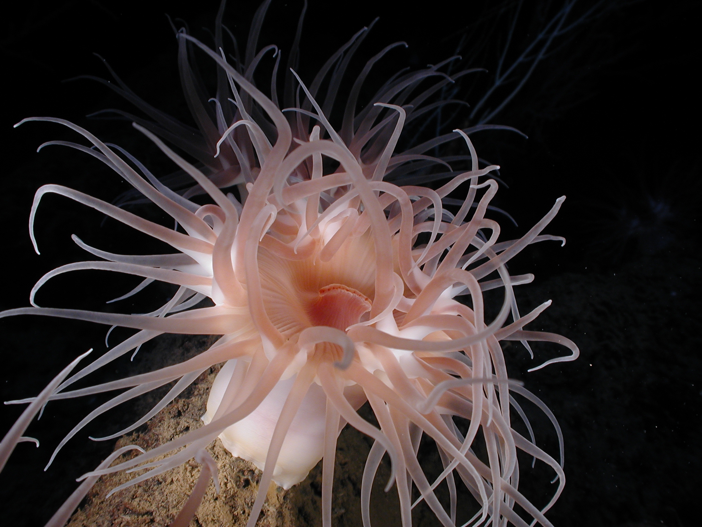

# Introduction
\minitoc

## Mini Table of Contents

The mini table of contents that you see in the PDF is created by adding `\minitoc` to the markdown file after the header for the chapter.

## Tables

You can create tables in your markdown files as well.

| Header #1 | Header #2 |
|-----------|-----------|
| data | more data |
| data 2 | more data 2|

## Figures

Any figures for your book should be added to the `figures/` directory.

Here's a sample image below [@noaa_expl1676].

{#fig:anemone}

## Formulas

When $a \ne 0$, there are two solutions to $ax^2 + bx + c = 0$ and they are

$$x = {-b \pm \sqrt{b^2-4ac} \over 2a}$$

This paragraph does not have any formulas but should render the dollar sign properly in $5.
